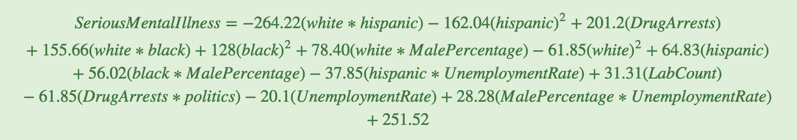

# Predicting Serious Mental Illness Population with a Regression Model

## Project Definition:
Can we predict the number of Serious Mental Illnesses (SMI)† in the U.S with certain features?

## Features:
- Number of drug arrests
- White, Black, and Hispanic population
- Median Income
- Male Percentage
- Unemployment Rate
- Number of drug labs found††
- Whether the state was Republican or Democratic

**Note:**   
† Serious mental illness (SMI), as defined by the National Survey on Drug Use (NSDUH) is defined as having a diagnosable mental, behavioral, or emotional disorder, other than a developmental or substance use disorder, as assessed by the Mental Health Surveillance Study (MHSS) Structured Clinical Interview for the Diagnostic and Statistical Manual of Mental Disorders—Fourth Edition—Research Version—Axis I Disorders (MHSS-SCID), which is based on the 4th edition of the Diagnostic and Statistical Manual of Mental Disorders (DSM-IV). SMI includes individuals with diagnoses resulting in serious functional impairment. For details, see Section B of the ""2011-2012 NSDUH: Guide to State Tables and Summary of Small Area Estimation Methodology"" at http://www.samhsa.gov/data/."

†† DEA's website contains addresses of some locations where law enforcement agencies reported they found chemicals or other items that indicated the presence of either clandestine drug laboratories or dumpsites. In most cases, the source of the entries is not the Department, and the Department has not verified the entry and does not guarantee its accuracy.

## Constructing the Data Frame:
The dataframe consists of data for years 2014-2017 segmented by states. Selection of features was a mix of intuition and what was available, e.g. demographics like race and gender per state. Although, as noted, the SMI does not include substance use disorders, we wanted to test if the number of drug arrests can be one of the predictors of SMI population in a given state. It could be argued that unemployment rate is not independent of the other features; that is why we checked the correlation amongst all the set independent variables. We were also curious to see if the number of drug labs found in a state and a state's political stance is correlated to and are good indicators of the SMI population.

### Dataframe :

### Pair plot matrix of the features and dependent variable:

**As you can see in the first column, where the dependent variable is on the y-axis, there are some relationships visible before doing any feature selection/engineering. e.g. the relationship between SMI and drug arrests seems to be linear.**

## Regression Model:

Below are several iterations of regression model. The difference amongst those iterations are detailed along with yielded metrics.

###  Iteration 1:

R-squared value of 0.826 is a great result. However, the p-values for the featured variables > 0.05.  
Next iteration scaled the data (train and test set) and used a polynomial fit with a degree = 2.

###  Iteration 2:

R-squared of 0.923 is better than previous model's R-squared. There were still some variables with p-values way above 0.05 that needed to be removed. Next model used filtered method: variance test.

###  Iteration 3:

Still had some variables with p-values > 0.05. Next model used wrapper method.

###  Iteration 4:

Most variables' p-values are well below 0.05 except one variable. Decided to remove this variable.

###  Iteration 5:

Final R-squared value was 0.865 and all features' p-values < 0.05, and RMSE and stddev values are satisfactory. Therefore conclude regression model analysis and found best fit model for our data.

Below are some illustrations of the final linear model.

#### Residual Graph:

#### Heat Map:

Regression Model:

The model tells us that predicting Serious Mental Illness population for a given state in a given year can be determined using the following formula. e.g. If the unemployment rate was to go up 1%, SMI counts will go down 20.1. It's an interesting interpretation to finding the number of SMI cases. It should be noted that for the final model the root-mean-squared-error (RMSE) was 70.72, and standardized RMSE was 0.35. This means that predicted value will be on average +/-70.72 from the actual value.

We also did a cross validation (K-Fold) on our train data, and got an average R-squared value of 0.58. This means that our model explains 58% of the variability of the response data around its mean.
